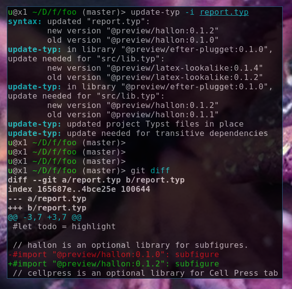

# typast

Parser for Typst.

## offline-typ tool

The [`offline-typ`](cmd/offline-typ) tool converts Typst files for offline use. It can be used to vendor dependencies of Typst projects.

All Typst files used by a project, including transitive dependencies are rewritten to use vendored copies of external libraries (which are stored in `/libs` of the output directory).

### Install

```bash
go install github.com/mewmew/typast/cmd/offline-typ@latest
```

### Usage

Example usage:
```bash
# Convert report.typ and transitive dependencies for offline use.
offline-typ report.typ
```

Example diff:
```diff
-#import "@local/uni-report:0.1.0"
+#import "/libs/uni-report/0.1.0/src/lib.typ" as uni-report

-#import "@preview/latex-lookalike:0.1.3"
+#import "/libs/latex-lookalike/0.1.3/src/lib.typ" as latex-lookalike
```

### Screenshot

Screenshot of example usage, where all the dependencies (Typst packages) and resources (images and bibliography) are vendored for reproducibility, offline use and easy sharing of Typst projects that rely on unfinished/unpublished packages (such as the development version of `fancy-units`).


## update-typ tool

The [`update-typ`](cmd/update-typ) tool updates dependencies in Typst files.

All Typst files used by a project are rewritten to use the latest version of each dependency (imported package).

If old versions are identified in transitive dependencies, a warning is emitted so the upstream package author can be notified.

### Install

```bash
go install github.com/mewmew/typast/cmd/update-typ@latest
```

### Usage

Example usage:
```bash
# Rewrite report.typ to use the latest version of imported packages.
#
# Output stored in "foo/" directory.
update-typ -out foo report.typ

# Rewrite report.typ to use the latest version of imported packages.
#
# Typst files are rewritten "in place".
update-typ -i report.typ
```

Example diff:
```diff
-#import "@preview/hallon:0.1.0": subfigure
+#import "@preview/hallon:0.1.2": subfigure
```

### Screenshot

Screenshot of example usage, where all the dependencies (Typst packages) are updated to their latest version.



## parse-typ tool

The [`parse-typ`](cmd/parse-typ) tool parses and prints the CST (Concrete Syntax Tree) of Typst files.

### Install

```bash
go install github.com/mewmew/typast/cmd/parse-typ@latest
```

### Usage

Example usage:
```bash
# Parse foo.typ and print its CST.
parse-typ foo.typ
```

Example input (`foo.typ`):
```typst
Hello #text(fill: blue)[_world_]
```

Example output:
```
inner (kind="markup")
  leaf (kind="text") text="Hello"
  leaf (kind="space") text=" "
  leaf (kind="hash") text="#"
  inner (kind="function call")
    leaf (kind="identifier") text="text"
    inner (kind="call arguments")
      leaf (kind="opening paren") text="("
      inner (kind="named pair")
        leaf (kind="identifier") text="fill"
        leaf (kind="colon") text=":"
        leaf (kind="space") text=" "
        leaf (kind="identifier") text="blue"
      leaf (kind="closing paren") text=")"
      inner (kind="content block")
        leaf (kind="opening bracket") text="["
        inner (kind="markup")
          inner (kind="emphasized content")
            leaf (kind="underscore") text="_"
            inner (kind="markup")
              leaf (kind="text") text="world"
            leaf (kind="underscore") text="_"
        leaf (kind="closing bracket") text="]"
  leaf (kind="space") text="\n"
```

## License

Code derived from the [Typst](https://github.com/typst/typst) project is governed the [Apache License](https://github.com/typst/typst/blob/main/LICENSE).
